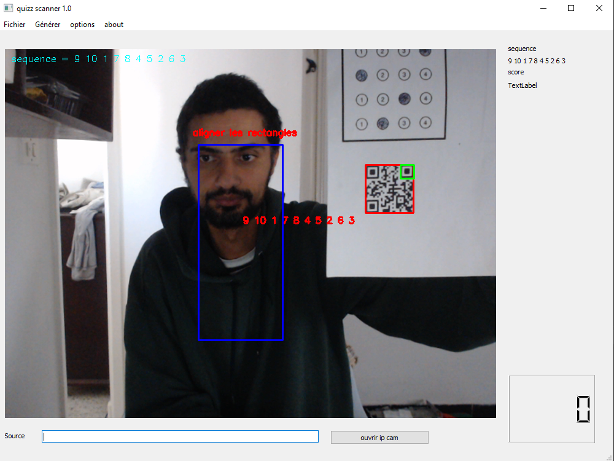
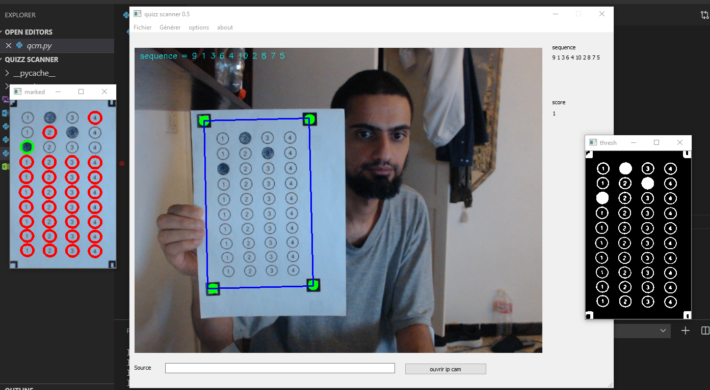

# Description
quizz scanner is a simple opencv application that can generate unique(random) bubble quizz tests and evaluate them based on a qrcode holding the order of the questions making cheating a little bit harder for students(better than nothing , i suppose).

# Installation
Use the package manager pip to install the dependencies

```bash
pip install numpy opencv-contrib-python openpyxl pyzbar imutils PyQt5 qimage2ndarray python-docx pyqrcode
```

pyzbar requires  [Visual C++ Redistributable Packages for Visual Studio 2013](https://www.microsoft.com/en-US/download/details.aspx?id=40784) to work

start the app by typing python qcm.py

# Usage
fill quizz.xlsx with the question , the answers(4) and the number of the right one.
use demo.docx to generate the quizz.
use quizz.docx for the responses.
after launching the app , show the qrcode to initialize the evaluation (qrcode contains the sequence matching with the questions in the excel file needed after the shuffle).


now , show the bubble sheet and the work is done !!!


the générer menu will make a demo.docx with differents tests.
the number of tests and the questions for each test can be set in the options menu.
as you can tell from the number of the version , the work is still in but i thought it's time to share it :shipit: hoping to improve it with the feedback.

please send me an email at boujrida.mohamedoussama@gmail.com for any question , suggestion(s)


